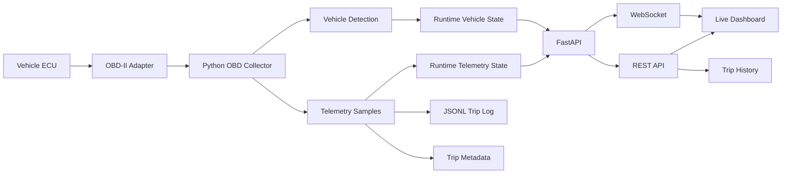

# Vehicle Telemetry Platform

A real-time vehicle telemetry and test platform built in Python around live OBD-II data acquisition.

The project connects to a physical vehicle through an OBD-II adapter, automatically identifies the connected vehicle, streams telemetry to a browser dashboard, records trip sessions, monitors acquisition health, detects connection loss, and provides historical trip analysis.

The goal is to treat vehicle telemetry as a small hardware-test and operations system rather than just a dashboard.

## Features

- Live OBD-II telemetry acquisition
  - RPM
  - vehicle speed
  - throttle position
  - engine load
- Automatic vehicle detection
- VIN-based identification when supported
- Fingerprint-based fallback for vehicles that do not expose VIN
- Saved vehicle profiles for repeat detection
- Automatic plug-in detection while idle
- Automatic disconnect detection
- Explicit trip lifecycle
  - scan vehicle
  - start trip
  - stop trip
- Real-time WebSocket telemetry streaming
- Browser-based live dashboard
- Rolling telemetry charts
- Acquisition health monitoring
  - sample rate
  - sample duration
  - missing values
  - query failures
- JSONL trip recording
- Trip metadata summaries
- Distance estimation from OBD speed data
- Moving time and stopped time tracking
- Average moving speed
- Historical trip browser
- Historical telemetry charts
- Clean shutdown handling for active WebSocket connections

## System Architecture



## Runtime State Model

The application separates vehicle discovery from trip recording.

```text
Waiting for vehicle
        |
        v
     Scanning
        |
        v
   Vehicle Ready
        |
        v
    Start Trip
        |
        v
     Recording
        |
        v
     Stop Trip
        |
        v
   Vehicle Ready
```

While the application is idle, it periodically checks whether the previously identified vehicle is still physically reachable.

If the OBD-II adapter is unplugged, the cached vehicle state is cleared and the system returns to `Waiting for vehicle`.

During an active trip, the collector owns the OBD connection and handles disconnect detection directly.

## Vehicle Identification

Vehicle identification uses two strategies.

### VIN identification

If the vehicle supports the OBD-II VIN command, the VIN is read from the ECU and decoded through the NHTSA vPIC API.

### Fingerprint fallback

Some vehicles do not expose VIN through OBD-II.

For those vehicles, the platform builds a fingerprint from available diagnostic information such as:

- OBD protocol
- calibration ID
- calibration verification number
- supported command set

The fingerprint can be associated with a saved vehicle profile and automatically recognized on later connections.

## Live Dashboard

The live dashboard provides:

- vehicle identity
- connection state
- Scan Vehicle control
- Start Trip control
- Stop Trip control
- Trip History navigation
- RPM
- speed
- throttle
- engine load
- rolling charts
- telemetry acquisition health

The dashboard receives live samples through a FastAPI WebSocket connection.

## Trip Recording

Trip samples are stored as JSON Lines (`.jsonl`) so each telemetry sample is recorded as an independent JSON object.

Example sample:

```json
{
  "sequence": 42,
  "timestamp": "2026-09-07T20:45:10.123456+00:00",
  "rpm": 1834,
  "speed_mph": 31.4,
  "throttle_pct": 18.8,
  "load_pct": 42.7,
  "sample_duration_ms": 72.1,
  "sample_rate_hz": 0.93,
  "missing_values": 0,
  "query_failures": 0,
  "connection_status": "Car Connected"
}
```

Completed trips also receive a metadata summary containing metrics such as:

- start and end time
- duration
- sample count
- vehicle identity
- maximum RPM
- maximum speed
- average RPM
- average speed
- distance
- moving time
- stopped time
- average moving speed
- average sample duration
- average sample rate
- missing-value count
- query-failure count

## Historical Analysis

Completed trips can be reviewed in the Trip History interface.

Each trip includes:

- vehicle
- timestamp
- duration
- distance
- sample count
- summary metrics
- RPM history
- speed history
- throttle history
- engine-load history
- acquisition-health statistics

## Project Structure

```text
vehicle-telemetry-platform/
|
|-- api/
|   |-- __init__.py
|   |-- dashboard.html
|   |-- server.py
|   |-- test_client.py
|   `-- trips.html
|
|-- telemetry/
|   |-- __init__.py
|   |-- collector.py
|   |-- logger.py
|   |-- models.py
|   |-- normalizer.py
|   |-- runtime_state.py
|   |-- trip_controller.py
|   `-- vehicle.py
|
|-- data/
|   `-- trips/              # ignored by Git
|
|-- main.py
|-- vehicle_profiles.json   # ignored by Git
`-- .gitignore
```

## Technology

- Python 3
- FastAPI
- Uvicorn
- python-OBD
- WebSockets
- Requests
- Chart.js
- HTML / CSS / JavaScript
- JSON / JSONL
- NHTSA vPIC API

## Hardware

Development has been performed with an OBDLink EX USB OBD-II adapter.

The current development configuration expects the adapter on:

```text
COM3
```

The code can be extended later to support configurable or automatic serial-port discovery.

## Running Locally

### 1. Clone the repository

```bash
git clone git@github.com:richardrhanly-us/vehicle-telemetry-platform.git
cd vehicle-telemetry-platform
```

### 2. Create a virtual environment

Windows PowerShell:

```powershell
python -m venv .venv
.\.venv\Scripts\Activate.ps1
```

### 3. Install dependencies

```powershell
pip install -r requirements.txt
```

### 4. Connect the OBD-II adapter

Connect the OBD-II adapter to the vehicle and computer.

The current collector expects the serial connection on `COM3`.

### 5. Start the application

```powershell
python main.py
```

Then open:

```text
http://127.0.0.1:8000/dashboard
```

Trip history is available at:

```text
http://127.0.0.1:8000/trips
```

## API

Current application endpoints include:

```text
GET  /                         Service status

GET  /vehicle                  Current vehicle
GET  /api/vehicle/status       Vehicle detection state
POST /api/vehicle/scan         Scan for a vehicle

GET  /api/trip/status          Current trip state
POST /api/trip/start           Start recording
POST /api/trip/stop            Stop recording

GET  /api/trips                Completed trip summaries
GET  /api/trips/{trip_id}      Trip metadata and samples

WS   /ws/telemetry             Live telemetry stream
```

## Engineering Focus

This project is intentionally structured around problems that appear in real hardware and telemetry systems:

- physical-device connection lifecycle
- partial hardware capability support
- graceful fallback behavior
- acquisition reliability
- asynchronous state updates
- serial-device ownership
- real-time streaming
- event-driven UI state
- persistence of time-series data
- historical analysis
- failure detection
- clean application shutdown

One important design decision was separating **vehicle detection** from **trip recording**.

The first version opened the OBD connection, identified the vehicle, and created a trip from one operation. The current architecture treats those as separate states so an operator can inspect the system without generating unwanted trip data.

## Privacy

Recorded trip files and local vehicle profiles are excluded from source control.

The repository `.gitignore` excludes:

```text
data/trips/
vehicle_profiles.json
```

VIN data is not exposed through the browser dashboard or trip API.

## Roadmap

Planned improvements include:

- configurable telemetry condition / alarm engine
- persisted event timeline
- live warnings and severity levels
- telemetry annotations
- replay source for recorded trips
- telemetry source abstraction
- configurable serial-port selection
- automatic serial-port discovery
- additional automated tests
- improved offline operation
- packaged dependency management
- additional acquisition-health diagnostics

A future source abstraction is planned around a model similar to:

```text
TelemetrySource
    |
    |-- OBDSource
    `-- ReplaySource
```

This would allow the rest of the platform to operate independently of whether telemetry is coming from real hardware or a recorded session.

## Motivation

The project was built as a hands-on exploration of real-time telemetry, hardware integration, test infrastructure, and operator-facing software.

Rather than simulating a telemetry pipeline, it uses a real vehicle ECU as the data source and has required handling practical issues such as unsupported diagnostic commands, VIN-less vehicles, serial connection ownership, hardware disconnects, acquisition failures, and session lifecycle management.

## License

No license has been added yet.
